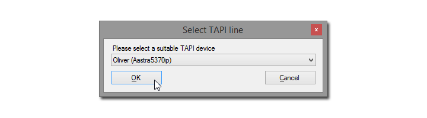

tel: Protocol Handler
=====================

Accepts `tel:` links on Windows Hosts and dials the given number on the configured TAPI line.

The first time you start the application, it will ask for the TAPI line to use.

All future calls will then directly be dialed on that line.

> To reconfigure, just start the application again, without parameters.

License
-------
GNU GPL v3.0